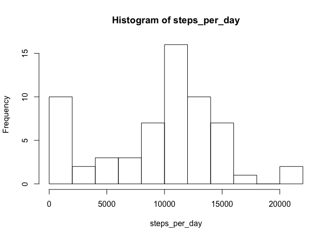
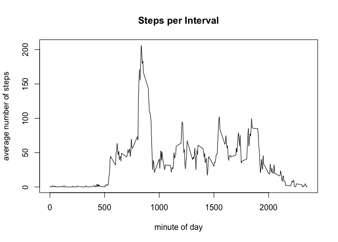
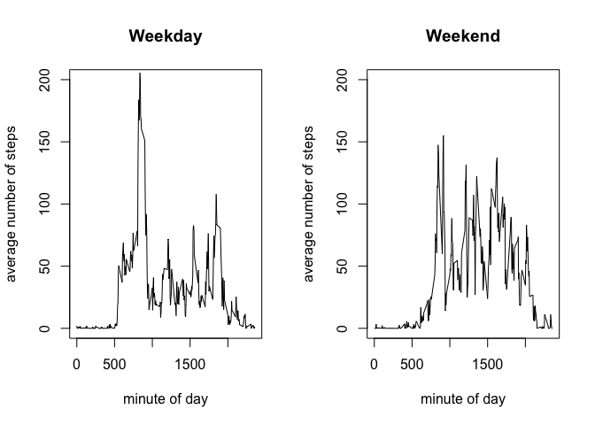

# Reproducible Research: Peer Assessment 1

Copyright Eric Chow, Johns Hopkins University (January 2017)

This report demonstrates the use of R markdown to create a pdf document that describes a simple analysis of walking data available through Coursera. The data (contained in activity.zip) provides the count of the number of steps per interval for a variety of dates.  The following vignettes demonstrate the R code that can be used to analyze the data.


## Loading and preprocessing the data
To load the code and preprocess the data, the following code block was ran to unzip the data and read the data into a data frame. The dates needed to be formatted appropriately:

```r
activity <- read.table(unz("activity.zip", "activity.csv"),header=T, sep=",")
activity$date <- as.Date(activity$date, format="%Y-%m-%d")
```
let's take a look at the data.

```r
summary(activity)
```

```
##      steps             date               interval     
##  Min.   :  0.00   Min.   :2012-10-01   Min.   :   0.0  
##  1st Qu.:  0.00   1st Qu.:2012-10-16   1st Qu.: 588.8  
##  Median :  0.00   Median :2012-10-31   Median :1177.5  
##  Mean   : 37.38   Mean   :2012-10-31   Mean   :1177.5  
##  3rd Qu.: 12.00   3rd Qu.:2012-11-15   3rd Qu.:1766.2  
##  Max.   :806.00   Max.   :2012-11-30   Max.   :2355.0  
##  NA's   :2304
```

## What is mean total number of steps taken per day?
Since the data is provided per interval, we need to first apply the sum function, by date to the number of steps using this command:

```r
steps_per_day <- tapply(activity$steps, activity$date, function(x) sum(x, na.rm=TRUE))
```
Now that we've collapsed the data to date-level, we can easily create a histogram of the number of steps per day.

```r
hist(steps_per_day, breaks=8)
```

<!-- -->


We can also calculate the mean (9354.2295082) and median (10395) of the number of steps taken per day using these R commands:


```r
mean_steps <- mean(steps_per_day)
median_steps <- median(steps_per_day)
```


## What is the average daily activity pattern?
Now let's consider the pattern of steps taken within a day.  We'll average the number of steps taken per 5-minute interval across the days and see if there is a pattern. To do this, we'll need to tapply again, but this time on the interval instead of date.


```r
steps_intrv <- tapply(activity$steps, activity$interval,
    function(x) mean(x, na.rm=TRUE))
interval <- as.numeric(names(steps_intrv))
avg_steps <- steps_intrv
steps_per_intrvl <- data.frame(interval, avg_steps)
plot(avg_steps ~ interval, data = steps_per_intrvl, type="l",
    ylab="average number of steps", xlab="minute of day",
    main="Steps per Interval")
```

<!-- -->


The 5-minute interval that has the highest average number of steps per day is interval 835 with an average of 206.1698113 steps taken. The R-code is shown below:


```r
max_int <- interval[avg_steps == max(avg_steps)]
max_steps <- max(avg_steps)
```


## Imputing missing values

There were a 2304 days/intervals that had missing values for the number of steps. We'll impute them using the median of the interval across days using the following R-code. We'll save it into a new dataset, activity_:


```r
activity_ <- activity
activity_$impute <- 0
for (i in 1:nrow(activity_)) {
    if (is.na(activity_[i,"steps"])) {
        activity_[i,"steps"] <- median(activity_[activity_$interval ==
            activity_[i,"interval"],"steps"], na.rm=TRUE)
        activity_[i,"impute"] <- 1
    }
}
```


Let's see the histogram of steps per day after imputation:

```r
hist(steps_per_day_, breaks=8)
```

<!-- -->

let's also recalculate the mean and median steps per day:

```r
mean(steps_per_day_)
```

```
## [1] 9503.869
```

```r
median(steps_per_day_)
```

```
## [1] 10395
```

we can see that the mean number of steps per day has increased with imputation (from 9354.2295082).  The median number of steps however, has not changed from 10395.  This makes sense, as missing intervals would be ignored when summing with na.rm=TRUE.  When we impute them, the sum of steps has to increase as we have more intervals.  The median steps did not change, and that it likely due to the nature of the distribution of steps per day.

## Are there differences in activity patterns between weekdays and weekends?

Using the imputed dataset, activity_, let's investigate whether the weekday makes a difference. We'll determine whether the day is a weekday or not, using the weekdays() function:


```r
activity_$day_type <- factor(
    (weekdays(activity_$date) %in% c("Sunday", "Saturday")),
    labels=c("weekday", "weekend")
)
```
head(activity_)
Now we can use tapply to calculate the number of steps per day:


```r
steps_imp <- tapply(activity_$steps,
    activity_[,c("interval","day_type")],
    function(x) mean(x, na.rm=TRUE))
head(steps_imp)
```

```
##         day_type
## interval    weekday weekend
##       0  2.02222222    0.00
##       5  0.40000000    0.00
##       10 0.15555556    0.00
##       15 0.17777778    0.00
##       20 0.08888889    0.00
##       25 1.31111111    3.25
```

```r
par(mfrow=c(1,2))
plot(weekday ~ interval, data = steps_imp, type="l",
    ylab="average number of steps", xlab="minute of day",
    main="Weekday", ylim=c(0,200))
plot(weekend ~ interval, data = steps_imp, type="l",
    ylab="average number of steps", xlab="minute of day",
    main="Weekend", ylim=c(0,200))
```

<!-- -->

It looks like the weekday sees fewer steps taken per 5-minute interval, except at interval 835 where the number of steps is at a maximum for the entire week.  The number of steps taken during the weekend do not have this spike and is more consistent throughout the day. There are nearly no steps taken before interval 500, this is likely when the person is still sleeping.
